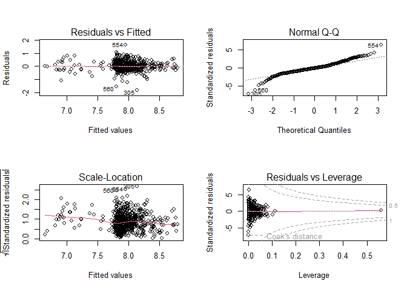

Keskiarvosanat ja S2-oppilaat sekä korkeakoulutustaso
================
2023-02-19

### Johdanto

Tämä dokumentti käsittelee Ylen artikkelia, joka käsitteli koulujen
päättäneiden keskiarvosanoja ja alueen mediaanituloja,
korkeakoulutustasoa, työllisyysastetta sekä S2-oppilaiden osuutta
(<https://yle.fi/a/74-20016772>). Tässä dokumentissa pyritään
selvittämään näiden ja muutaman muun taustamuuttujan vaikutus koulujen
keskiarvosanoihin. Huomautus datasta

Tulokset ovat valideja vain yläkouluille. Alakouluissa ei suurimmaksi
osaksi ollut keskiarvodataa.

``` r
mean(is.na(data$keskiarvo))
```

    ## [1] 0.6233583

### Datan esikäsittely

Valitaan käytettävät sarakkeet, ja poistetaan datasta puuttuvat arvot.

``` r
sarakkeet = c("oppilaitostyyppi_nimi", "oppilaitosnumero", "postinumeroalue", "kunta", "asukkaat_yht", "koulutus_kantaluku", "koulutus_alempi_kork", "koulutus_ylempi_kork", "asukkaiden_mediaanitulo", "oppilaita_yhteensa", "kieli", "tyollisyys_18_74", "suomi_toisena_kielena_ja_kirjallisuus", "keskiarvo")

data = data %>% dplyr::select(all_of(sarakkeet)) %>% drop_na()
```

Min max skaalataan sarakkeet välille \[0,1\] (poislukien keskiarvot
tulkitsemisen helpottamiseksi), ja lasketaan työllisyysaste,
korkeakoulutusaste ja S2-oppilaiden osuus.

``` r
range01 <- function(x){(x-min(x, na.rm = T))/(max(x, na.rm = T)-min(x, na.rm = T))}
data_scaled = as_tibble(sapply(data[,-c(1,14)], range01))
data_scaled$oppilaitosnimi = data$oppilaitostyyppi_nimi
data_scaled$keskiarvo = data$keskiarvo
data_scaled$tyollisyysaste = (data$tyollisyys_18_74 / data$asukkaat_yht)
data_scaled$korkeakouluaste = (data$koulutus_alempi_kork + data$koulutus_ylempi_kork) / data$koulutus_kantaluku
data_scaled$s2_osuus = data$suomi_toisena_kielena_ja_kirjallisuus / data$oppilaita_yhteensa
data_scaled[is.na(data_scaled)] = 0
```

### Malli ja tulokset

Tehdään robusti lineaarinen malli.

``` r
model1 = rlm(keskiarvo ~ tyollisyysaste + s2_osuus + korkeakouluaste + oppilaitosnimi + asukkaat_yht + asukkaiden_mediaanitulo + oppilaita_yhteensa, data = data_scaled)
summary(model1)
```

    ## 
    ## Call: rlm(formula = keskiarvo ~ tyollisyysaste + s2_osuus + korkeakouluaste + 
    ##     oppilaitosnimi + asukkaat_yht + asukkaiden_mediaanitulo + 
    ##     oppilaita_yhteensa, data = data_scaled)
    ## Residuals:
    ##      Min       1Q   Median       3Q      Max 
    ## -1.80258 -0.17522 -0.01067  0.16781  1.61146 
    ## 
    ## Coefficients:
    ##                                              Value    Std. Error t value 
    ## (Intercept)                                    7.9452   0.2218    35.8281
    ## tyollisyysaste                                 0.0203   0.2504     0.0812
    ## s2_osuus                                      -0.3989   0.1061    -3.7608
    ## korkeakouluaste                                1.8746   0.1915     9.7906
    ## oppilaitosnimiPeruskouluasteen erityiskoulut  -1.1217   0.0841   -13.3433
    ## oppilaitosnimiPeruskoulut                     -0.2225   0.0608    -3.6580
    ## asukkaat_yht                                  -0.1250   0.0825    -1.5143
    ## asukkaiden_mediaanitulo                       -0.1906   0.1934    -0.9854
    ## oppilaita_yhteensa                            -0.0214   0.0824    -0.2604
    ## 
    ## Residual standard error: 0.2546 on 607 degrees of freedom

Keskiarvosana kouluilla on 7.9. Tilastollisesti merkitsevät muuttujat
ovat laskevassa järjestyksessä:

1.  Oppilaitostyyppi (Peruskoulut ja lukio (vertailutaso), Peruskoulut,
    peruskouluasteen erityiskoulut). Verrattuna peruskouluihin ja
    lukioihin erityiskoulut saavat keskimäärin 1.1 arvosanaa heikompia
    arvosanoja, ja peruskoulut saavat 0.2 arvosanaa heikompia arvosanoja
    kuin peruskoulut ja lukiot.

2.  Korkeakoulutusaste. Korkeakoulutusasteella on erittäin merkittävä
    vaikutus koulun keskiarvosanoihin. Alueilla, jolla kaikki ovat
    korkeakoulutettuja saadaan 1.9 arvosanaa parempia arvosanoja kuin
    alueilla jossa kukaan ei ole korkeasti koulutettu.

3.  S2-oppilaiden osuus. Alueilla, jossa koulussa on pelkästään
    S2-oppilaita saadaan keskimäärin 0.4 arvosanaa heikompia arvosanoja
    kuin alueilla, jossa ei ole yhtään S2-oppilasta.

Loput taustamuuttujista eivät olleet tilastollisesti merkityksellisiä.
Mallin diagnostiikkaa

``` r
par(mfrow = c(2,2))
plot(model1)
```

<!-- -->

Residuaalit poikkeavat hieman normaalista jakauman hännillä. Muuten
diagnostiikka näyttää hyvältä.

``` r
vif(model1)
```

    ##                             GVIF Df GVIF^(1/(2*Df))
    ## tyollisyysaste          1.367410  1        1.169363
    ## s2_osuus                1.340767  1        1.157915
    ## korkeakouluaste         3.347050  1        1.829494
    ## oppilaitosnimi          1.555482  2        1.116776
    ## asukkaat_yht            1.493037  1        1.221899
    ## asukkaiden_mediaanitulo 2.410760  1        1.552662
    ## oppilaita_yhteensa      1.485473  1        1.218800

Selittävät muuttujat eivät ole liian riippuvia toisistaan.
